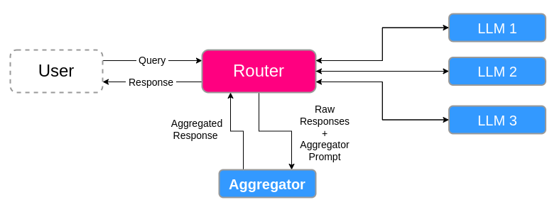

[![Flare](https://img.shields.io/badge/flare-network-e62058.svg?logo=data:image/svg+xml;base64,PHN2ZyB4bWxucz0iaHR0cDovL3d3dy53My5vcmcvMjAwMC9zdmciIHdpZHRoPSIzNCIgaGVpZ2h0PSIzNCI+PHBhdGggZD0iTTkuNC0uMWEzMjAuMzUgMzIwLjM1IDAgMCAwIDIuOTkuMDJoMi4yOGExMTA2LjAxIDExMDYuMDEgMCAwIDEgOS4yMy4wNGMzLjM3IDAgNi43My4wMiAxMC4xLjA0di44N2wuMDEuNDljLS4wNSAyLTEuNDMgMy45LTIuOCA1LjI1YTkuNDMgOS40MyAwIDAgMS02IDIuMDdIMjAuOTJsLTIuMjItLjAxYTQxNjEuNTcgNDE2MS41NyAwIDAgMS04LjkyIDBMMCA4LjY0YTIzNy4zIDIzNy4zIDAgMCAxLS4wMS0xLjUxQy4wMyA1LjI2IDEuMTkgMy41NiAyLjQgMi4yIDQuNDcuMzcgNi43LS4xMiA5LjQxLS4wOXoiIGZpbGw9IiNFNTIwNTgiLz48cGF0aCBkPSJNNy42NSAxMi42NUg5LjJhNzU5LjQ4IDc1OS40OCAwIDAgMSA2LjM3LjAxaDMuMzdsNi42MS4wMWE4LjU0IDguNTQgMCAwIDEtMi40MSA2LjI0Yy0yLjY5IDIuNDktNS42NCAyLjUzLTkuMSAyLjVhNzA3LjQyIDcwNy40MiAwIDAgMC00LjQtLjAzbC0zLjI2LS4wMmMtMi4xMyAwLTQuMjUtLjAyLTYuMzgtLjAzdi0uOTdsLS4wMS0uNTVjLjA1LTIuMSAxLjQyLTMuNzcgMi44Ni01LjE2YTcuNTYgNy41NiAwIDAgMSA0LjgtMnoiIGZpbGw9IiNFNjIwNTciLz48cGF0aCBkPSJNNi4zMSAyNS42OGE0Ljk1IDQuOTUgMCAwIDEgMi4yNSAyLjgzYy4yNiAxLjMuMDcgMi41MS0uNiAzLjY1YTQuODQgNC44NCAwIDAgMS0zLjIgMS45MiA0Ljk4IDQuOTggMCAwIDEtMi45NS0uNjhjLS45NC0uODgtMS43Ni0xLjY3LTEuODUtMy0uMDItMS41OS4wNS0yLjUzIDEuMDgtMy43NyAxLjU1LTEuMyAzLjM0LTEuODIgNS4yNy0uOTV6IiBmaWxsPSIjRTUyMDU3Ii8+PC9zdmc+&colorA=FFFFFF)](https://dev.flare.network/)

# Flare AI Consensus

## flare-ai-consensus Pipeline

The flare-ai-consensus template consists of the following components:

* **Router:** The primary interface that receives user requests, distributes them to the various AI models, and collects their intermediate responses.
* **Aggregator:** synthesizes multiple model responses into a single, coherent output.
* **Consensus Layer:** Defines logic for the consensus algorithm. The reference implementation is setup in the following steps:
  * The initial prompt is sent to a set of models, with additional system instructions.
  * Initial responses are aggregated by the Aggregator.
  * Improvement rounds follow up where aggregated responses are sent as additional context or system instructions to the models.

## OpenRouter Clients

We implement two OpenRouter clients for interacting with the OpenRouter API: a standard sync client and an asynchronous client.
Both of these are constructed on top of base classes (`BaseRouter` and `AsyncBaseRouter`, respectively) which include simple logic for API interaction.
Namely, the base classes introduce the `get` and `post` requests.

The `OpenRouterProvider` (and `AsyncOpenRouterProvider`) build on these base classes by providing specific API endpoints for interacting with the OpenRouter API.

## Messaging

Every message sent to the **Chat Completion** endpoint must specify one of the following roles:

* `system`: Provides context and guidelines for the conversation.
* `user`: Contains the queries or instructions directed to the model.
* `assistant`: Represents the model’s responses. Any message with this role is treated as a previous response from the model.

For the consensus learning algorithm, messages are sent to the LLMs via OpenRouter.
Standard (*i.e.* non-aggregated) messages are sent using the `send_round()` method in `consensus/consensus.py`:

* **Initial messages** (first round messages): These consist of a `user` query with possibly additional `system` instructions.
* **Follow-up conversations**: Built using the `build_improvement_conversation()` method and contain include:
  * The initial conversation defined within `input.json`.
  * The aggregated prompt from the aggregator, with the role assigned in the `aggregated_prompt_type` field of `input.json`.
  * The `improvement_prompt` defined in `input.json`, which is assigned a `user` role.

## Aggregator

The simplest aggregation method is a simple concatenation of multiple responses, and can be achieved using the `_concatenate_aggregator()` method of `consensus/aggregator.py`.

In contrast, the `centralized_llm_aggregator()` method relies on a specified LLM to which the individual responses are sent to.
The prompt is built as follows:

* A first message defined in the `aggregator_context` field of the `input.json`.
* A `system` message containing all responses from the contributing LLMs, concatenated together.
* A `user` message defined in the `aggregator_prompt` field of the `input.json`.

## Config

The data from the `input.json` is loaded into a set of classes, defined within `settings.py`:

* `ModelConfig`: a class for specifying an LLM.
* `AggregatorConfig`: a class dedicated to the aggregator model.
* `ConsensusConfig`: the main class used for loading the input data.
